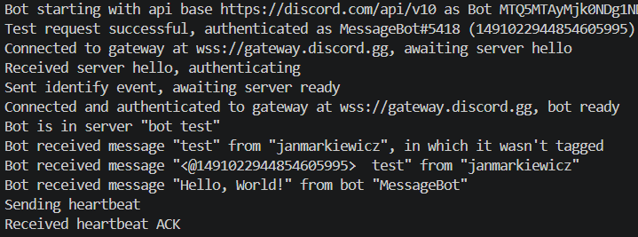
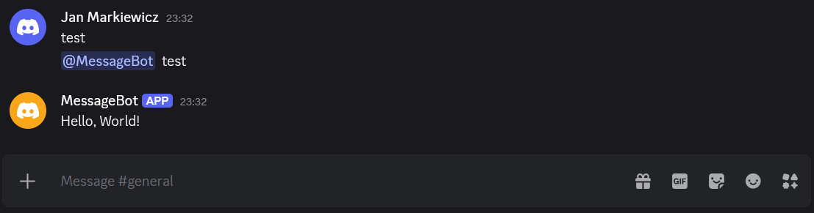

# E-Biznes

## [Zadanie 1 - Docker](./1/)

- [x] 3.0 [obraz ubuntu z Pythonem w wersji 3.10](./1/3.0.Dockerfile)
- [x] 3.5 [obraz ubuntu:24.0~~2~~4 z Javą w wersji 8 oraz Kotlinem](./1/3.5.Dockerfile)
- [x] 4.0 do powyższego należy [dodać najnowszego Gradle’a oraz paczkę JDBC SQLite](./1/4.0.Dockerfile) w ramach [projektu na Gradle (build.gradle)](./1/build.gradle)
- [x] 4.5 stworzyć [przykład typu HelloWorld](./1/HelloWorld.kt) oraz [uruchomienie aplikacji przez CMD oraz gradle](./1/4.5.Dockerfile)
- [x] 5.0 dodać [konfigurację docker-compose](./1/docker-compose.yaml)

Termin: 25.03

Punkty 3.0-4.5 powinny mieć osobny obraz Dockerowy.

Obraz dockerowy należy wrzucić na hub.docker.com.
Dockerfile oraz dodatkowe pliki powinny być na repozytorium git.
Readme powinno zawierać [link do obrazu na hub.docker.com](https://hub.docker.com/r/jmarkiewicz0/ebiznes-1).

## [Zadanie 2 - Scala](./2/)

Należy stworzyć aplikację na frameworku ~~Play~~ lub Scalatra.

- [x] 3.0 Należy stworzyć [kontroler do Produktów](./2/src/main/scala/example/ebiznes/ebiz2/Products.scala)
- [x] 3.5 Do kontrolera należy stworzyć endpointy zgodnie z CRUD - dane pobierane z listy
- [x] 4.0 Należy stworzyć kontrolery do [Kategorii](./2/src/main/scala/example/ebiznes/ebiz2/Categories.scala) oraz [Koszyka](./2/src/main/scala/example/ebiznes/ebiz2/Cart.scala) + endpointy zgodnie z CRUD
- [x] 4.5 Należy aplikację uruchomić na dockerze ([stworzyć obraz](./2/Dockerfile)) oraz dodać [skrypt uruchamiający aplikację via ngrok](./2/run.sh)
- [x] 5.0 Należy dodać [konfigurację CORS](./2/src/main/scala/ScalatraBootstrap.scala) dla dwóch hostów dla metod CRUD

Kontrolery mogą bazować na listach zamiast baz danych. CRUD: show all, show by id (get), update (put), delete (delete), add (post).

<https://scalatra.org/getting-started/first-project.html>
~~<https://www.playframework.com/>~~

## [Zadanie 3 - Kotlin](./3/)

- [x] 3.0 Należy stworzyć [aplikację kliencką w Kotlinie we frameworku Ktor](./3/src/main/kotlin/Main.kt), która pozwala na przesyłanie wiadomości na platformę Discord
- [x] 3.5 Aplikacja jest w stanie odbierać wiadomości użytkowników z platformy Discord skierowane do aplikacji (bota)
- [x] 4.0 Zwróci listę kategorii na określone żądanie użytkownika
- [x] 4.5 Zwróci listę produktów wg żądanej kategorii
- [ ] 5.0 Aplikacja obsłuży dodatkowo jedną z platform: Slack lub Messenger

Aplikację należy uruchomić [na dockerze](./3/Dockerfile).

## [Zadanie 4 - Go](./4/)

Należy stworzyć projekt w echo w Go. Należy wykorzystać gorm do stworzenia kilka modeli, gdzie pomiędzy dwoma musi być relacja. Należy zaimplementować proste endpointy do dodawania oraz wyświetlania danych za pomocą modeli. Jako bazę danych można wybrać dowolną, sugerowałbym jednak pozostać przy sqlite.

- [x] 3.0 Należy stworzyć aplikację we frameworki echo w j. Go, która będzie miała kontroler Produktów zgodny z CRUD
- [ ] 3.5 Należy stworzyć model Produktów wykorzystując gorm oraz wykorzystać model do obsługi produktów (CRUD) w kontrolerze (zamiast listy)
- [ ] 4.0 Należy dodać model Koszyka oraz dodać odpowiedni endpoint
- [ ] 4.5 Należy stworzyć model kategorii i dodać relację między kategorią, a produktem
- [ ] 5.0 pogrupować zapytania w gorm’owe scope'y

Termin: 15.04
