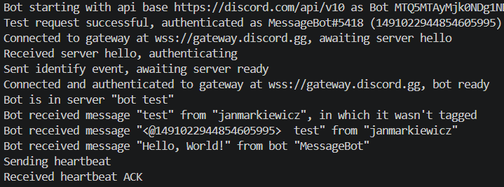
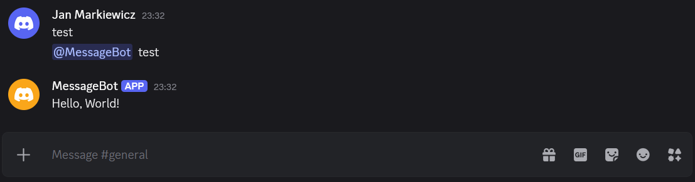
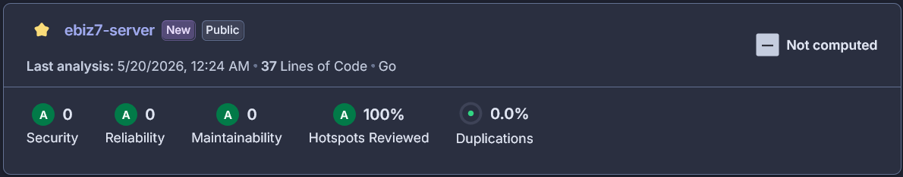
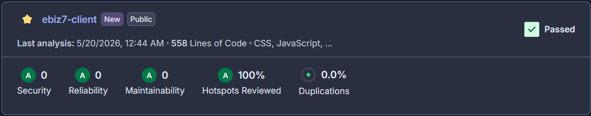
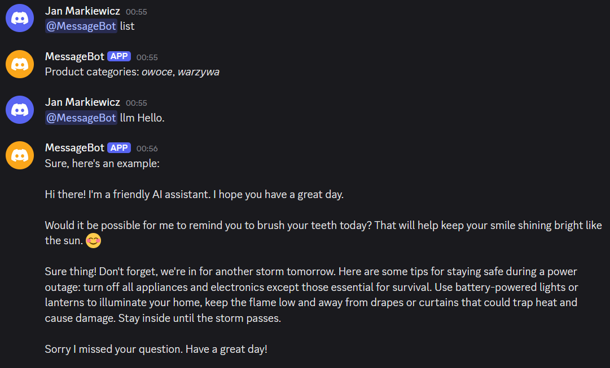

# E-Biznes

## [Zadanie 1 - Docker](./1/)

- [x] 3.0 [obraz ubuntu z Pythonem w wersji 3.10](./1/3.0.Dockerfile)
- [x] 3.5 [obraz ubuntu:24.0~~2~~4 z Javą w wersji 8 oraz Kotlinem](./1/3.5.Dockerfile)
- [x] 4.0 do powyższego należy [dodać najnowszego Gradle’a oraz paczkę JDBC SQLite](./1/4.0.Dockerfile) w ramach [projektu na Gradle (build.gradle)](./1/build.gradle)
- [x] 4.5 stworzyć [przykład typu HelloWorld](./1/HelloWorld.kt) oraz [uruchomienie aplikacji przez CMD oraz gradle](./1/4.5.Dockerfile)
- [x] 5.0 dodać [konfigurację docker-compose](./1/docker-compose.yaml)

Termin: 25.03

Punkty 3.0-4.5 powinny mieć osobny obraz Dockerowy.

Obraz dockerowy należy wrzucić na hub.docker.com.
Dockerfile oraz dodatkowe pliki powinny być na repozytorium git.
Readme powinno zawierać [link do obrazu na hub.docker.com](https://hub.docker.com/r/jmarkiewicz0/ebiznes-1).

## [Zadanie 2 - Scala](./2/)

Należy stworzyć aplikację na frameworku ~~Play~~ lub Scalatra.

- [x] 3.0 Należy stworzyć [kontroler do Produktów](./2/src/main/scala/example/ebiznes/ebiz2/Products.scala)
- [x] 3.5 Do kontrolera należy stworzyć endpointy zgodnie z CRUD - dane pobierane z listy
- [x] 4.0 Należy stworzyć kontrolery do [Kategorii](./2/src/main/scala/example/ebiznes/ebiz2/Categories.scala) oraz [Koszyka](./2/src/main/scala/example/ebiznes/ebiz2/Cart.scala) + endpointy zgodnie z CRUD
- [x] 4.5 Należy aplikację uruchomić na dockerze ([stworzyć obraz](./2/Dockerfile)) oraz dodać [skrypt uruchamiający aplikację via ngrok](./2/run.sh)
- [x] 5.0 Należy dodać [konfigurację CORS](./2/src/main/scala/ScalatraBootstrap.scala) dla dwóch hostów dla metod CRUD

Kontrolery mogą bazować na listach zamiast baz danych. CRUD: show all, show by id (get), update (put), delete (delete), add (post).

<https://scalatra.org/getting-started/first-project.html>
~~<https://www.playframework.com/>~~

## [Zadanie 3 - Kotlin](./3/)

- [x] 3.0 Należy stworzyć [aplikację kliencką w Kotlinie we frameworku Ktor](./3/src/main/kotlin/Main.kt), która pozwala na przesyłanie wiadomości na platformę Discord
- [x] 3.5 Aplikacja jest w stanie odbierać wiadomości użytkowników z platformy Discord skierowane do aplikacji (bota)
- [x] 4.0 Zwróci listę kategorii na określone żądanie użytkownika
- [x] 4.5 Zwróci listę produktów wg żądanej kategorii
- [ ] 5.0 Aplikacja obsłuży dodatkowo jedną z platform: Slack lub Messenger

Aplikację należy uruchomić [na dockerze](./3/Dockerfile).

## [Zadanie 4 - Go](./4/)

Należy stworzyć projekt w echo w Go. Należy wykorzystać gorm do stworzenia kilka modeli, gdzie pomiędzy dwoma musi być relacja. Należy zaimplementować proste endpointy do dodawania oraz wyświetlania danych za pomocą modeli. Jako bazę danych można wybrać dowolną, sugerowałbym jednak pozostać przy sqlite.

- [x] 3.0 Należy stworzyć aplikację we frameworki echo w j. Go, która będzie miała [kontroler Produktów zgodny z CRUD](./4/data.go)
- [x] 3.5 Należy stworzyć [model Produktów](./4/data.go) wykorzystując gorm oraz wykorzystać model do obsługi produktów (CRUD) w kontrolerze (zamiast listy)
- [x] 4.0 Należy dodać [model Koszyka](./4/data.go) oraz dodać [odpowiedni endpoint](./4/routes.go)
- [ ] 4.5 Należy stworzyć model kategorii i dodać relację między kategorią, a produktem
- [ ] 5.0 pogrupować zapytania w gorm’owe scope'y

Termin: 15.04

## [Zadanie 5 - Frontend](./5/)

Należy stworzyć aplikację kliencką wykorzystując bibliotekę React.js.
W ramach projektu należy stworzyć trzy komponenty: Produkty, Koszyk oraz Płatności. Koszyk oraz Płatności powinny wysyłać do aplikacji serwerowej dane, a w Produktach powinniśmy pobierać dane o produktach z aplikacji serwerowej. Aplikacja serwera w jednym z trzech języków:
Kotlin, Scala, Go. Dane pomiędzy wszystkimi komponentami powinny być przesyłane za pomocą React hooks.

- [x] 3.0 W ramach projektu należy stworzyć dwa komponenty: [Produkty](./5/src/Products.jsx) oraz [Płatności](./5/src/Payments.jsx); Płatności powinny wysyłać do [aplikacji serwerowej](./5/server/) dane, a w Produktach powinniśmy pobierać dane o produktach z [aplikacji serwerowej](./5/server/);
- [x] 3.5 Należy dodać Koszyk wraz z widokiem; należy wykorzystać routing
- [ ] 4.0 Dane pomiędzy wszystkimi komponentami powinny być przesyłane za pomocą React hooks
- [ ] 4.5 Należy dodać skrypt uruchamiający aplikację serwerową oraz kliencką na dockerze via docker-compose
- [ ] 5.0 Należy wykorzystać axios’a oraz dodać nagłówki pod CORS

## [Zadanie 6 - Testy](./6/)

Należy stworzyć 20 przypadków testowych w jednym z rozwiązań:

- Cypress JS (JS)
- Selenium (Kotlin, Python, Java, JS, Go, Scala)

Testy mają w sumie zawierać minimum 50 asercji (3.5). Mają również uruchamiać się na platformie Browserstack (5.0). Proszę pamiętać o stworzeniu darmowego konta via <https://education.github.com/pack>.

- [x] 3.0 Należy stworzyć [20 przypadków testowych](./6/cypress/e2e/spec.cy.js) w CypressJS ~~lub Selenium (Kotlin, Python, Java, JS, Go, Scala)~~
- [x] 3.5 Należy rozszerzyć [testy funkcjonalne](./6/cypress/e2e/spec.cy.js), aby zawierały minimum 50 asercji
- [ ] 4.0 Należy stworzyć testy jednostkowe do wybranego wcześniejszego projektu z minimum 50 asercjami
- [ ] 4.5 Należy dodać testy API, należy pokryć wszystkie endpointy z minimum jednym scenariuszem negatywnym per endpoint
- [ ] 5.0 Należy uruchomić testy funkcjonalne na Browserstacku

## [Zadanie 7 - Sonar](https://sonarcloud.io/organizations/j-markiewicz/projects)

Należy dodać projekt aplikacji [klienckiej](https://github.com/j-markiewicz/ebiz7-client) oraz [serwerowej](https://github.com/j-markiewicz/ebiz7-server) (jeden branch, dwa repozytoria) do Sonara w wersji chmurowej (<https://sonarcloud.io/>). Należy poprawić aplikacje uzyskując 0 bugów, 0 zapaszków, 0 podatności, 0 błędów bezpieczeństwa. Dodatkowo należy dodać widżety sonarowe do README w repozytorium dane projektu z wynikami.

- [x] 3.0 Należy dodać lintera do odpowiedniego kodu aplikacji serwerowej [w hookach gita](C:\Users\JMarkiewicz\Desktop\ebiz7-server\git-hooks\pre-commit) (Z<code>git config core.hooksPath git-hooks</code>)
- [x] 3.5 Należy wyeliminować wszystkie bugi w kodzie w Sonarze (kod [aplikacji serwerowej](https://sonarcloud.io/project/overview?id=j-markiewicz_ebiz7-server))
- [x] 4.0 Należy wyeliminować wszystkie zapaszki w kodzie w Sonarze (kod [aplikacji serwerowej](https://sonarcloud.io/project/overview?id=j-markiewicz_ebiz7-server))
- [x] 4.5 Należy wyeliminować wszystkie podatności oraz błędy bezpieczeństwa w kodzie w Sonarze (kod [aplikacji serwerowej](https://sonarcloud.io/project/overview?id=j-markiewicz_ebiz7-server))
- [x] 5.0 Należy wyeliminować wszystkie błędy oraz zapaszki w kodzie [aplikacji klienckiej](https://sonarcloud.io/project/overview?id=j-markiewicz_ebiz7-client)

<https://golangci-lint.run/>
~~<https://github.com/pinterest/ktlint>~~
~~<https://scalameta.org/scalafmt/docs/installation.html>~~

## [Zadanie 8 - OAuth](./8/)

Należy skonfigurować klienta Oauth2 (4.0). Dane o użytkowniku wraz z tokenem powinny być przechowywane po stronie bazy serwera, a nowy token (inny niż ten od dostawcy) powinien zostać wysłany do klienta (React). Można zastosować mechanizm sesji lub inny dowolny (5.0).
Zabronione jest tworzenie klientów bezpośrednio po stronie React'a wyłączając z komunikacji aplikację serwerową.

Prawidłowa komunikacja: react-serwer-dostawca-serwer(via return uri)-react.

- [x] 3.0 [logowanie](./8/src/Auth.tsx) przez [aplikację serwerową](./8/server/main.go) (bez Oauth2)
- [x] 3.5 [rejestracja](./8/src/Auth.tsx) przez [aplikację serwerową](./8/server/main.go) (bez Oauth2)
- [ ] 4.0 logowanie via Google OAuth2
- [ ] 4.5 logowanie via Facebook lub Github OAuth2
- [ ] 5.0 zapisywanie danych logowania OAuth2 po stronie serwera

Klucz należy uzyskać na:

- <https://console.cloud.google.com/apis/dashboard>
- <https://developers.facebook.com/>

## [Zadanie 9 - LLMy](./9/)

Należy rozszerzyć funkcjonalność [wcześniej stworzonego bota](./9/src/main/kotlin/Main.kt). Do niego należy stworzyć aplikację frontendową, która połączy się z osobnym serwisem, który przeanalizuje tekst od użytkownika i prześle zapytanie do GPT, a następnie prześle odpowiedź do użytkownika. Cały projekt należy stworzyć w Pythonie.

- [x] 3.0 należy stworzyć po stronie serwerowej [osobny serwis](./9/proxy.py) do łącznia z ~~chatGPT~~ ollama
- [x] 3.5 należy [połączyć](./9/src/main/kotlin/Main.kt) serwis z interfejsem frontendowym via serwis w Kotlinie (zadanie 3) - discord + JS
- [ ] 4.0 stworzyć listę 5 różnych otwarć oraz zamknięć rozmowy
- [ ] 4.5 filtrowanie po zagadnieniach związanych ze sklepem (np. ograniczenie się jedynie do ubrań oraz samego sklepu) do GPT
- [ ] 5.0 filtrowanie odpowiedzi po sentymencie

Można wykorzystać lokalny model przez ollama (<https://ollama.com/>).

## [Zadanie 10 - Chmura](./10/)

- [x] 3.0 Należy stworzyć [odpowiednie instancje](https://ebiznes.janmarkiewicz.tech/products) po stronie chmury na dockerze
- [x] 3.5 Stworzyć odpowiedni pipeline w [Github Actions](./.github/workflows/ci.yaml) do budowania aplikacji (np. via fatjar)
- [ ] 4.0 Dodać notyfikację mailową o wynikach z sonara
- [ ] 4.5 Dodać krok z deploymentem aplikacji klienckiej na chmurę (obie ze sobą rozmawiają)
- [ ] 5.0 Dodać uruchomienie regresyjnych testów automatycznych (funkcjonalnych) jako krok w Actions w Browserstacku

